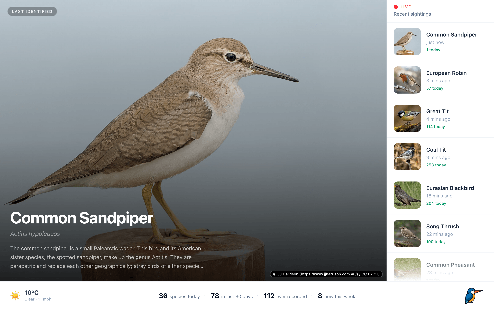
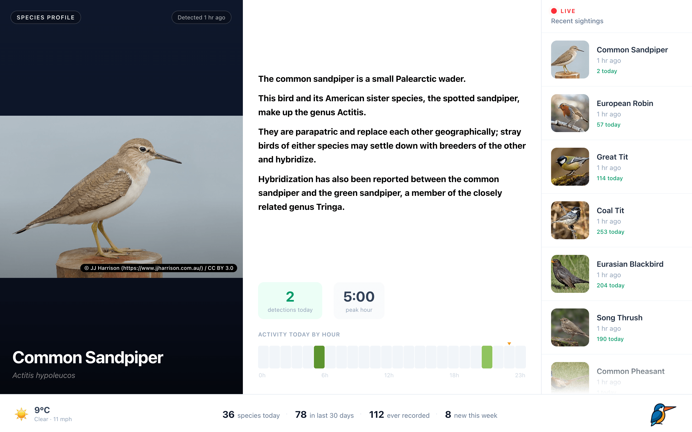
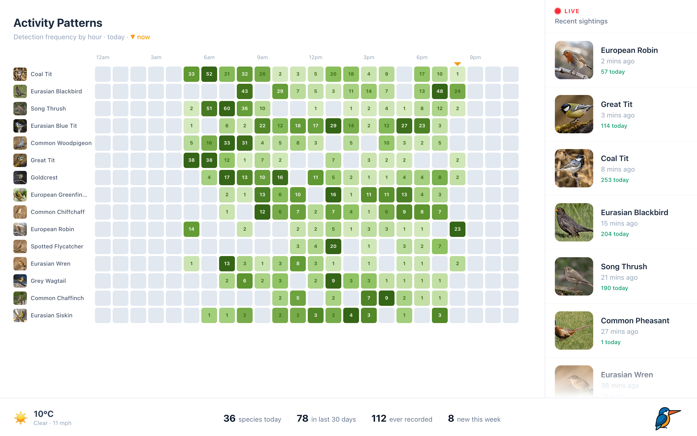
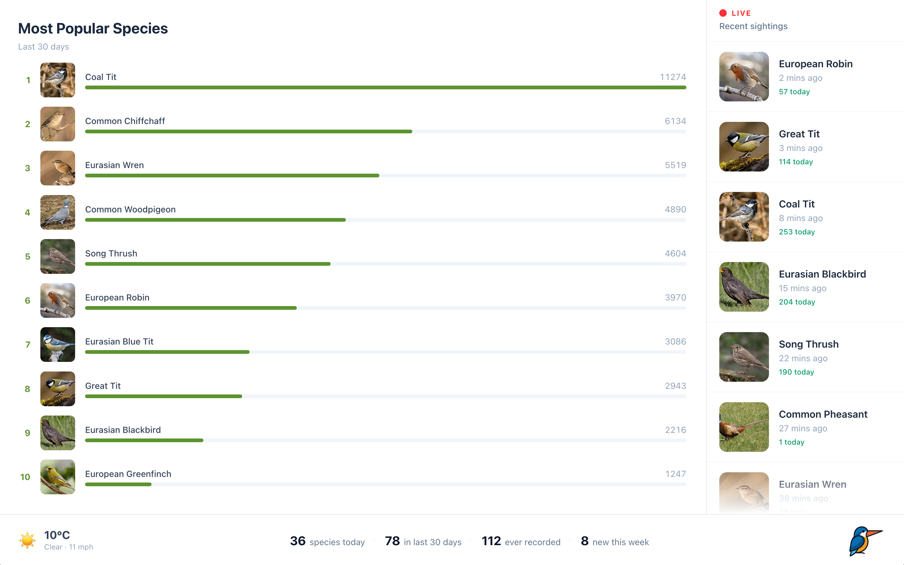
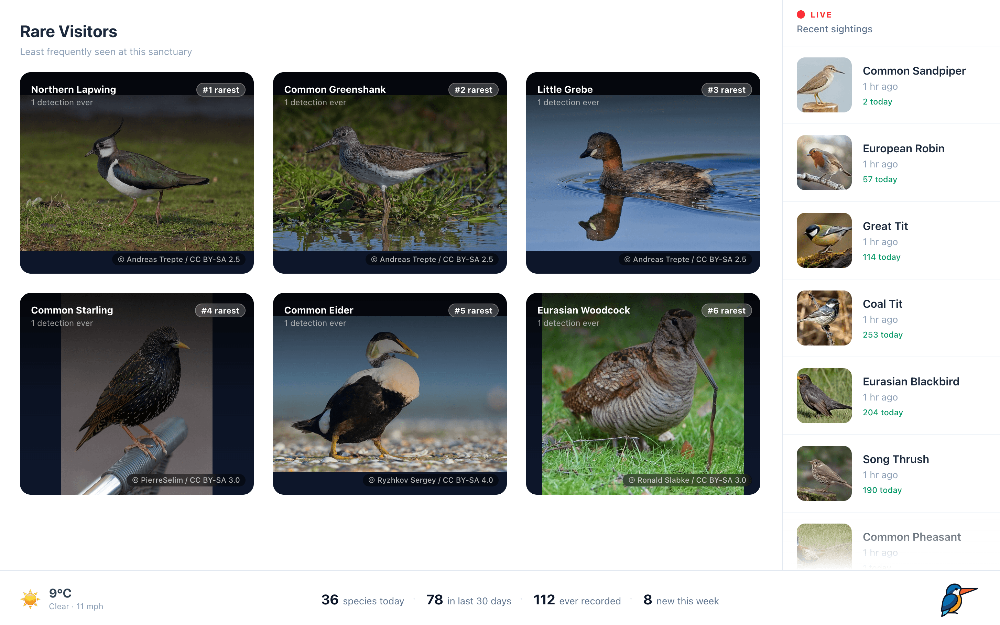

# BeakWatch

A kiosk display for [BirdNET-Go](https://github.com/tphakala/birdnet-go). Shows live bird detections, species spotlights, rare visitors, daily top birds, and local weather on a rotating full-screen hero panel. Designed for a wall-mounted screen/iPad to show your live detections and statistics in a beautiful way, without any interaction necessary.

This may just be so you can have a nice display at home for your family. But works particularly well in public places. Maybe you want to promote awareness of birds to those in the area and you could even place a screen in your front window to show the neighbours the wildlife they are living with!

> **Note:** Beakwatch is built as a fixed-layout for large screens (≥1280px wide) and iPads in landscape. It does not have a responsive mobile layout.

## Screenshots







## Features

- **Live detections sidebar** — newest detection per species, deduplicated.
- **Rotating hero** — last identified, species spotlight, top 10 over 30 days, 6 rarest visitors, today's species hourly chart.
- **On-demand bird images** — fetched from Wikipedia the first time a species appears, then cached on disk forever. The repo ships zero images.
- **Local weather** — current conditions from [Open-Meteo](https://open-meteo.com/) (no API key).
- **Multi-server support** — point at one or several BirdNET-Go instances and switch between them from the UI.

## Prerequisites

- **Node.js 20+** (uses global `fetch`).
- A reachable **BirdNET-Go** instance with the v2 HTTP API enabled.

## Quick start

```bash
# 1. Clone and install repo:
git clone https://github.com/beaktech/beakwatch
cd beakwatch
npm install
# 2. Create new env from example, uncomment lines and add your details (at minimum set BIRDNET_GO_URL):
cp .env.example server/.env
nano server/.env
# 3. run it!
npm run build
npm start
```

Open `http://localhost:3000`.

## Configuration

All config lives in `server/.env` (see `.env.example`).

| Variable             | Default     | Description                                                                                |
| -------------------- | ----------- | ------------------------------------------------------------------------------------------ |
| `BIRDNET_GO_URL`     | _(unset)_   | URL of your BirdNET-Go instance, e.g. `http://192.168.1.10:8080`. Required.                |
| `BIRDNET_GO_URLS`    | _(unset)_   | Comma-separated URLs for multiple instances. Overrides `BIRDNET_GO_URL`.                   |
| `BIRDNET_GO_NAMES`   | hostname    | Comma-separated display names matching `BIRDNET_GO_URLS` (e.g. `Garden,Office`).           |
| `LAT`                | `51.5074`   | Latitude for the weather widget.                                                           |
| `LON`                | `-0.1278`   | Longitude for the weather widget.                                                          |
| `PORT`               | `3000`      | Port the kiosk server listens on.                                                          |

## Architecture

```
Browser  ──/api/*─▶  Express (server/index.js)  ──▶  BirdNET-Go (REST)
                          │
                          ├──/birds/*─▶  cache/birds/  (disk)
                          │                    │ miss
                          │                    ▼
                          │              Wikipedia REST API
                          │
                          └──static────▶  dist/  (built React app)
```

- **Express** (`server/`): proxies BirdNET-Go, serves the built frontend, and runs the on-demand image cache.
- **React + Vite** (`src/`): the kiosk UI. Tailwind for styling, Vitest for tests.
- **Image cache** (`server/birdImages.js`): on a request for `/birds/<slug>.jpg?name=<commonName>&w=<width>`, serves from `cache/birds/<slug>-<width>.jpg` if present; otherwise hits Wikipedia for the species summary, downloads the sized thumbnail, writes it to disk, and serves it. Concurrent requests for the same image are deduped; outbound traffic is capped at 2 concurrent requests with backoff on HTTP 429.

The `cache/` directory is gitignored and grows organically as new species are detected (~50–200 KB per species).

## Development

```bash
npm install
cp .env.example server/.env
npm run dev    # vite (5173) + nodemon-watched express (3000)
```

Vite proxies `/api` and `/birds/*.jpg` to Express. Open `http://localhost:5173`.

### Scripts

| Command            | What it does                                  |
| ------------------ | --------------------------------------------- |
| `npm run dev`      | Vite + Express in watch mode                  |
| `npm run build`    | Build the React app to `dist/`                |
| `npm start`        | Serve `dist/` and the API from Express        |
| `npm test`         | Run the Vitest suite once                     |
| `npm run test:watch` | Vitest in watch mode                        |

### Trust model

Beakwatch is designed for a **trusted LAN** and has no authentication. Specifically:

- The `/api/server` POST route lets any client on the network switch the active BirdNET-Go instance.
- The `/birds/*.jpg` route lets any client trigger Wikipedia downloads and disk writes to `cache/`, and the `?name=` parameter controls which Wikipedia page an image is cached from — so a client could fill the disk or poison cached images.

If you expose Beakwatch beyond a network you trust, put it behind a reverse proxy with auth, or gate these routes yourself.

## Contributing

Issues and PRs are welcome. Before opening a PR, run `npm run lint && npm test` — CI runs both plus a build.

## Attribution

Bird photos and summaries come from [Wikipedia](https://en.wikipedia.org/) and [Wikimedia Commons](https://commons.wikimedia.org/). Each photo is displayed with its photographer credit and licence (`src/components/Attribution.jsx`). **Keep this attribution visible** — it is the licence requirement for reusing those images.

Weather data from [Open-Meteo](https://open-meteo.com/) under their terms of use.

## License

MIT — see [LICENSE](LICENSE).
